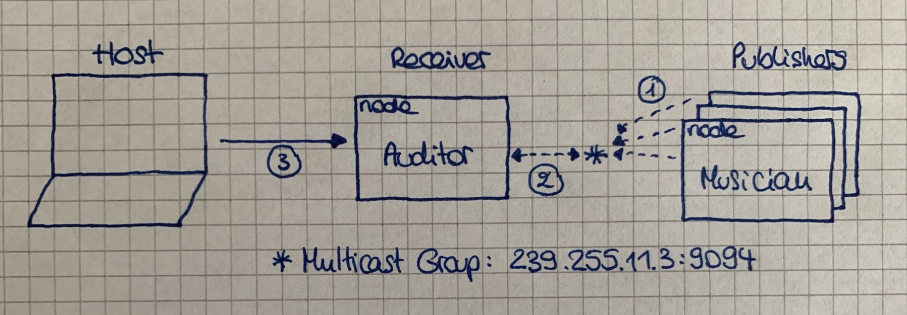

# Teaching-HEIGVD-RES-2020-Labo-Orchestra

## Admin

* **You can work in groups of 2 students**.
* It is up to you if you want to fork this repo, or if you prefer to work in a private repo. However, you have to **use exactly the same directory structure for the validation procedure to work**. 
* We expect that you will have more issues and questions than with other labs (because we have a left some questions open on purpose). Please ask your questions on Telegram / Teams, so that everyone in the class can benefit from the discussion.

## Objectives

This lab has 4 objectives:

* The first objective is to **design and implement a simple application protocol on top of UDP**. It will be very similar to the protocol presented during the lecture (where thermometers were publishing temperature events in a multicast group and where a station was listening for these events).

* The second objective is to get familiar with several tools from **the JavaScript ecosystem**. You will implement two simple **Node.js** applications. You will also have to search for and use a couple of **npm modules** (i.e. third-party libraries).

* The third objective is to continue practicing with **Docker**. You will have to create 2 Docker images (they will be very similar to the images presented in class). You will then have to run multiple containers based on these images.

* Last but not least, the fourth objective is to **work with a bit less upfront guidance**, as compared with previous labs. This time, we do not provide a complete webcast to get you started, because we want you to search for information (this is a very important skill that we will increasingly train). Don't worry, we have prepared a fairly detailed list of tasks that will put you on the right track. If you feel a bit overwhelmed at the beginning, make sure to read this document carefully and to find answers to the questions asked in the tables. You will see that the whole thing will become more and more approachable.


## Requirements

In this lab, you will **write 2 small NodeJS applications** and **package them in Docker images**:

* the first app, **Musician**, simulates someone who plays an instrument in an orchestra. When the app is started, it is assigned an instrument (piano, flute, etc.). As long as it is running, every second it will emit a sound (well... simulate the emission of a sound: we are talking about a communication protocol). Of course, the sound depends on the instrument.

* the second app, **Auditor**, simulates someone who listens to the orchestra. This application has two responsibilities. Firstly, it must listen to Musicians and keep track of **active** musicians. A musician is active if it has played a sound during the last 5 seconds. Secondly, it must make this information available to you. Concretely, this means that it should implement a very simple TCP-based protocol.


### Instruments and sounds

The following table gives you the mapping between instruments and sounds. Please **use exactly the same string values** in your code, so that validation procedures can work.

| Instrument | Sound         |
|------------|---------------|
| `piano`    | `ti-ta-ti`    |
| `trumpet`  | `pouet`       |
| `flute`    | `trulu`       |
| `violin`   | `gzi-gzi`     |
| `drum`     | `boum-boum`   |

### TCP-based protocol to be implemented by the Auditor application

* The auditor should include a TCP server and accept connection requests on port 2205.
* After accepting a connection request, the auditor must send a JSON payload containing the list of <u>active</u> musicians, with the following format (it can be a single line, without indentation):

```
[
  {
  	"uuid" : "aa7d8cb3-a15f-4f06-a0eb-b8feb6244a60",
  	"instrument" : "piano",
  	"activeSince" : "2016-04-27T05:20:50.731Z"
  },
  {
  	"uuid" : "06dbcbeb-c4c8-49ed-ac2a-cd8716cbf2d3",
  	"instrument" : "flute",
  	"activeSince" : "2016-04-27T05:39:03.211Z"
  }
]
```

### What you should be able to do at the end of the lab


You should be able to start an **Auditor** container with the following command:

```
$ docker run -d -p 2205:2205 res/auditor
```

You should be able to connect to your **Auditor** container over TCP and see that there is no active musician.

```
$ telnet IP_ADDRESS_THAT_DEPENDS_ON_YOUR_SETUP 2205
[]
```

You should then be able to start a first **Musician** container with the following command:

```
$ docker run -d res/musician piano
```

After this, you should be able to verify two points. Firstly, if you connect to the TCP interface of your **Auditor** container, you should see that there is now one active musician (you should receive a JSON array with a single element). Secondly, you should be able to use `tcpdump` to monitor the UDP datagrams generated by the **Musician** container.

You should then be able to kill the **Musician** container, wait 5 seconds and connect to the TCP interface of the **Auditor** container. You should see that there is now no active musician (empty array).

You should then be able to start several **Musician** containers with the following commands:

```
$ docker run -d res/musician piano
$ docker run -d res/musician flute
$ docker run -d res/musician flute
$ docker run -d res/musician drum
```
When you connect to the TCP interface of the **Auditor**, you should receive an array of musicians that corresponds to your commands. You should also use `tcpdump` to monitor the UDP trafic in your system.


## Task 1: design the application architecture and protocols

| # | Topic |
| --- | --- |
| Question | How can we represent the system in an **architecture diagram**, which gives information both about the Docker containers, the communication protocols and the commands? |
| | The first dotted arrows represents the musician docker nodes sending UDP datagrams to the multicast group.  The first dotted arrows represents the auditor docker node joining the multicast group to receive UDP datagrams.  The regular arrow reprensents the host sending TCP connection request to the defined port : 2205 and receiving the active musicians. |
| Question | Who is going to **send UDP datagrams** and **when**? |
| | The musicians are going to send UDP datagrams every second on the defined multicast group (239.255.11.3:9094). |
| Question | Who is going to **listen for UDP datagrams** and what should happen when a datagram is received? |
| | The auditor is going to listen for UDP datagrams by joining the multicast group. The auditor shall store the content of the datagram in a dictionary of activeMusicians. |
| Question | What **payload** should we put in the UDP datagrams? |
| | The payload of the datagramm should be a serialized object. It should contain an object that must contain the following keys : - uuid, - sound/notes. |
| Question | What **data structures** do we need in the UDP sender and receiver? When will we update these data structures? When will we query these data structures? |
| | A dictionary can be used to store the defined data, dictionaries are very easy to use. The sender will always send the same dicitonary. The receiver will update the doctionary on intrevals. The host will ask to see the reciever's dictionary. |


## Task 2: implement a "musician" Node.js application

| # | Topic |
| --- | --- |
| Question | In a JavaScript program, if we have an object, how can we **serialize it in JSON**? |
| | The JSON.stringify(myObject) function allows us to serialize myObject in JSON string format. |
| Question | What is **npm**? |
| | npm is a packet manager for Node.js. It's use simplifies managing dependencies and module accessibility. |
| Question | What is the `npm install` command and what is the purpose of the `--save` flag?  |
| | `npm install` command can be used to install a module, the module is added by default to your package.json as a dependency. Adding the flag `--save-*` lets you control where and how the are going to be stored, the star can be dev : `--save-dev`.  |
| Question | How can we use the `https://www.npmjs.com/` web site?  |
| | The npm website is very easy to use plateform. There is lot of documentation. On the home page you can look for packages/modules. |
| Question | In JavaScript, how can we **generate a UUID** compliant with RFC4122? |
| | `npm` has an easy/ready to use module complient with the RFC4122 called uuid. |
| Question | In Node.js, how can we execute a function on a **periodic** basis? |
| | The `timer` exposes global functions such as setInterval(callback, delay) to run functions at defined intervals. |
| Question | In Node.js, how can we **emit UDP datagrams**? |
| | We can emit UDP datagrams by using the `dgram` module, create an UDP socket and use the command send. |
| Question | In Node.js, how can we **access the command line arguments**? |
| | `process` is a global object to manage the current node process. It provides a property to get the provided agrmuents in an array : `process.argv`. |


## Task 3: package the "musician" app in a Docker image

| # | Topic |
| --- | --- |
| Question | How do we **define and build our own Docker image**?|
| | We need to define a node image to build our node application in a Dockerfile. We can builg our image using : `docker build -t image_name my_dir`. |
| Question | How can we use the `ENTRYPOINT` statement in our Dockerfile?  |
| | The `ENRTYPOINT` statement is used instead of the CMD statment to launch the node application using argments passed from the docker run command. We used : `ENTRYPOINT ["node", "/opt/app/auditor.js"]`, _auditor.js_ can be replaced with the main page of the application. |
| Question | After building our Docker image, how do we use it to **run containers**?  |
| | We can use the following command : `docker run -d res/musician trumpet`. |
| Question | How do we get the list of all **running containers**?  |
| | We can list all the running containers by typing the following command : `docker ps`. |
| Question | How do we **stop/kill** one running container?  |
| | We can stop a running container using the following command : `docker stop container_name`. We can kill a running container using th following command : `docker kill container_name`. Both of those commands can use containerID instead of the name of the container. |
| Question | How can we check that our running containers are effectively sending UDP datagrams?  |
| | We can check the network using WireShark or netcat on the docker network interface. |


## Task 4: implement an "auditor" Node.js application

| # | Topic |
| --- | ---  |
| Question | With Node.js, how can we listen for UDP datagrams in a multicast group? |
| | We can listen for UDP datagrams by joining the multicast group. The `addMembership` on the UDP socket. |
| Question | How can we use the `Map` built-in object introduced in ECMAScript 6 to implement a **dictionary**?  |
| | `Map` and dictionary are very similar, excpept that `Map` implements useful methods. Both uses the pair key-value. |
| Question | How can we use the `Moment.js` npm module to help us with **date manipulations** and formatting?  |
| | We can use the `diff` method that uses a time/date et returns the difference between now and the time/date passed in arguments. |
| Question | When and how do we **get rid of inactive players**?  |
| | We get rid of inactive musicians when they did not play a sound/note in the last 5 seconds. A function is run every 5 seconds to check the last time they played something. |
| Question | How do I implement a **simple TCP server** in Node.js?  |
| | We can implement a simple TCP server using the `createServer` method privided by the `net` module. |


## Task 5: package the "auditor" app in a Docker image

| # | Topic |
| --- | --- |
| Question | How do we validate that the whole system works, once we have built our Docker image? |
| | We can validate the system by running the following command : ./validate.sh. |


## Constraints

Please be careful to adhere to the specifications in this document, and in particular

* the Docker image names
* the names of instruments and their sounds
* the TCP PORT number

Also, we have prepared two directories, where you should place your two `Dockerfile` with their dependent files.

Have a look at the `validate.sh` script located in the top-level directory. This script automates part of the validation process for your implementation (it will gradually be expanded with additional operations and assertions). As soon as you start creating your Docker images (i.e. creating your Dockerfiles), you should try to run it.

-----

## Sources

Dockerfile :  
https://docs.docker.com/engine/reference/builder/#entrypoint

Network :  
https://nodejs.org/api/net.html

UDP :  
https://nodejs.org/api/dgram.html#dgram_udp_datagram_sockets

Modules :  
https://nodejs.org/docs/v0.4.12/api/all.html#modules

JSON :  
https://developer.mozilla.org/fr/docs/Web/JavaScript/Reference/Objets_globaux/JSON/stringify

Dictionaries :  
https://pietschsoft.com/post/2015/09/05/javascript-basics-how-to-create-a-dictionary-with-keyvalue-pairs

UUID generator :  
https://www.npmjs.com/package/uuid

npm install :  
https://docs.npmjs.com/cli/install

Process :
https://nodejs.org/api/process.html

